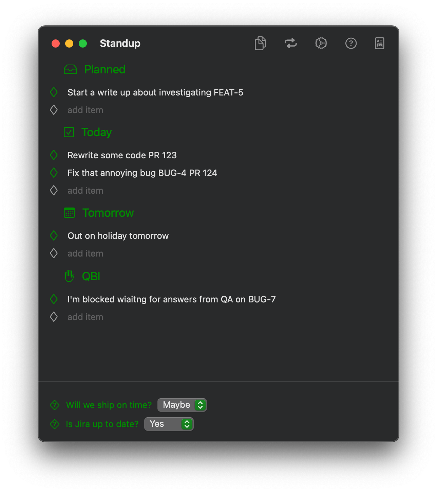

# HappyHour
**A daily standup tool**

This is a small application for MacOS that may help you keep track of notes for your daily standup. 
Especially if your standups are conducted asynchronously via Email, Slack, etc.
It runs as a menu bar application, so it doesn't clutter your dock.

The screenshot above will produce a message ready to paste into your standup thread, similar to this:

> **Today:**  
> ✅ Rewrite some code PR 123  
> ✅ Fix that annoying bug BUG-4 PR 124  
> **Tomorrow:**  
> ➡️ Out on holiday tomorrow  
> **QBI:**  
> ⁉️ I'm blocked waiting for answers from QA on BUG-7  
> **Will we ship on time?** 🤷  
> **Is Jira up to date?** ✅  

## Features
* Sections for planning, today, tomorrow, questions/blockers/interesting
* Auto-linking to
    * Pull requests 
    * Jira issues 
    * Other markdown links
* Drag items to reorder, even between sections
* Customizable reset behavior. By default, anything set for "Tomorrow" becomes "Planned"
* A few choices for section headers.
    * If you post standups in the evening, you can use Today/Tomorrow
    * If you post standups in the morning, you can use Yesterday/Today
* Define your own Yes/No questions to be included at the bottom of a standup report

## Build
1. Open the xcode project (Big sur required)
2. Build and run
